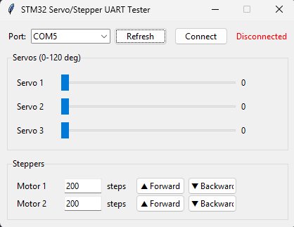

<p align="center">
  
</p>

<h1 align="center">STM32 Multi Motor Controller GUI</h1>

<p align="center">
  UART üzerinden STM32'ye bağlı servo ve step motorları kontrol etmek için hazırlanmış basit ve hafif bir Tkinter arayüzü.
</p>

<p align="center">
  
  
  
</p>

---

## Hakkında

Bu proje, `Command_t` UART protokolü ile haberleşen bir STM32 kartına bağlı **3 servo motor** ve **2 step motoru** test etmek/kontrol etmek için geliştirilmiş bir masaüstü uygulamasıdır. Seri port üzerinden 9 baytlık, CRC-16 korumalı paketler gönderir.

## Özellikler

- 🔌 Otomatik seri port tarama ve bağlantı yönetimi
- 🎚️ Kaydırma çubuklarıyla servo açısı kontrolü (0–120°)
- ⚙️ İleri/geri yön ve adım sayısı girişiyle step motor kontrolü
- ✅ CRC-16/CCITT-FALSE ile veri bütünlüğü doğrulaması
- 🖥️ Bağımlılığı az, sade Tkinter arayüzü

## Kurulum

```bash
pip install pyserial
```
1. Açılır listeden STM32 kartının bağlı olduğu seri portu seçin.
2. **Connect** butonuna tıklayın.
3. Servo kaydırıcılarını sürükleyerek açı gönderin veya step motor bölümünden adım sayısı girip **Forward / Backward** butonlarına basın.

## İletişim Protokolü

STM32 tarafındaki `uart_comm.h` ile birebir eşleşen, little-endian, 9 baytlık paket formatı:

| Alan         | Tip       | Açıklama                                         |
|--------------|-----------|---------------------------------------------------|
| `start_byte` | `uint8_t` | `0xAA`                                             |
| `cmd_type`   | `uint8_t` | `1` = servo, `2` = step motor                      |
| `sub_cmd`    | `uint8_t` | Motor/komut seçimi (aşağıya bakın)                 |
| `val`        | `uint16_t`| Açı (servo, 0–120) veya adım sayısı (step motor)   |
| `crc16`      | `uint16_t`| CRC-16/CCITT-FALSE (ilk 5 bayt üzerinden)          |
| `end_byte`   | `uint8_t` | `0x55`                                             |

**Servo alt komutları** (1 tabanlı): `1` = Servo 1, `2` = Servo 2, `3` = Servo 3

**Step motor alt komutları** (0 tabanlı):
`0` = Motor 1 geri · `1` = Motor 1 ileri · `2` = Motor 2 geri · `3` = Motor 2 ileri

## Gereksinimler

- Python 3.10+
- [pyserial](https://pypi.org/project/pyserial/)
